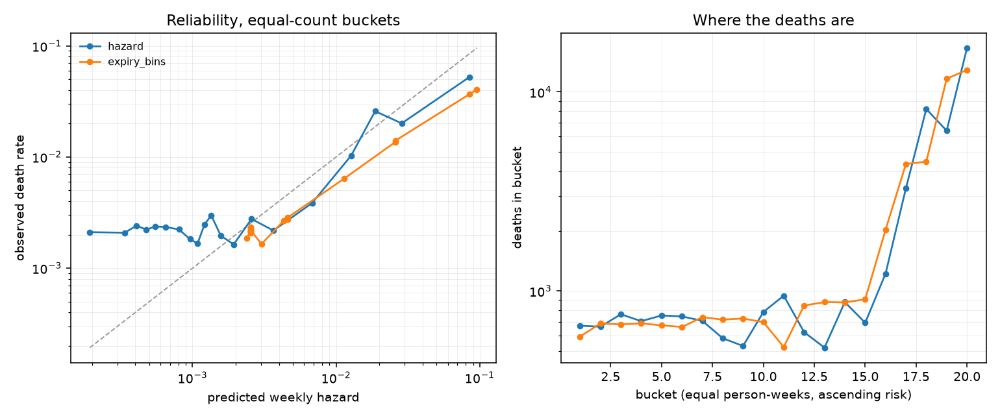

# Evaluation

What each model in this project scores, on what, and against what. Section 1 is the
naive baselines (T1.6), which are scored *before* the real model exists so that the
number it has to beat was fixed before anyone knew what it would produce. Section 2 is
the hazard model (T1.7) and GATE 1. Section 3 is calibration (T1.8), which is where the
model's honest weakness is. Section 4 is the shadow price (T3.4), computed twice by two
independent algorithms so that the headline rupee number is evidence rather than output.
Section 5 is what that price is for (T3.5): deciding one mandate at a time, without the
solver, and what that shape costs. Section 6 (T3.6) is the only *external* check in this
document -- our result against LinkedIn's published one -- and it is the one this project
fails.

Reproduce with:

```
uv run python scripts/build_periods.py --sample   # the frame, from the committed sample
uv run python scripts/score_baseline.py --sample  # section 1
uv run python scripts/fit_hazard.py --sample --plot   # sections 2 and 3
uv run python scripts/run_theta.py --sample       # section 4
```

Drop `--sample` for the full 58M-row frame. The numbers below are the full run; the
sample's are in §1.5 and are close enough to be a check on both.

---

## 1. Naive baselines (T1.6) -- done

### 1.1 How everything here is scored

**A model is a SQL expression that returns a probability.** The baselines are expressions
over one column; T1.7's logistic regression will be a sigmoid of a linear combination
whose coefficients were fitted elsewhere. Both are then scored by the same aggregate over
the same rows. If the baseline and the model were scored by different code, "the model
beats the baseline" would be a claim about two scripts as much as about two models -- and
GATE 1 turns on exactly that comparison.

It also means every model is scored on the **whole** held-out frame (6.35M person-weeks),
in about two seconds, rather than on whatever subsample fits in memory.

**The split is out of time.** Training is everything before 2016-12-06; the test set is
the 12 weeks after it, which is `horizon.weeks` -- the window the harness actually rolls
the world forward over. Two alternatives were rejected:

* A **random split of person-weeks** puts week 30 of a subscriber in training and week 31
  in test, so the model predicts a week it has effectively already seen.
* A **split by subscriber** answers "how well does this generalise to strangers?" This
  system is not deployed against strangers. It is deployed against a book it already
  knows, predicting forward.

**The last two weeks are dropped from both slices.** A death is only recorded once the
7-day renewal tolerance has elapsed without a renewal, so a week ending inside the last
`7 + 7` days of the log cannot contain a *confirmed* death. Those rows are not wrong --
their features are real -- but their labels are all zero for a reason that has nothing to
do with the subscribers. Leaving them in dropped the sample's test base rate from 0.0083
to 0.0078 and read as a miscalibrated model rather than as an artefact of the window. This
is `mapping.md` §2.2's right-censoring rule applied one layer down.

**Metrics.** Brier, log loss, mean prediction, and calibration-in-the-large (predicted
deaths over actual). Accuracy appears nowhere in this project: at a base rate of 1.4%, a
model that always says "survives" is 98.6% accurate and worthless.

Brier is reported as a **skill score** against the constant baseline -- the share of its
error removed -- because raw Brier at this base rate is around 0.007 for everything and
carries no information about which model is better.

### 1.2 The three baselines

| baseline | what it is | why it is here |
|---|---|---|
| `base_rate` | the training death rate for every row | the floor, and the reference every skill score is computed against |
| `expiry_rule` | 1 if coverage ends within 7 days, else 0 | the plan's phrasing taken literally; what a team without a model would actually ship |
| `expiry_bins` | the observed death rate per `days_to_coverage_end` bin | the same idea done as well as it can be done without a model -- the honest opponent |

All three are fitted on the training slice only. The bin edges are fixed
(0, 3, 7, 14, 30, 60, 120 days) rather than quantiles of the data, because quantile bins
would move whenever the data moved and a baseline that drifts is not a baseline.

### 1.3 What the billing clock is worth on its own

Training death rate per person-week: **0.0139**.

| `days_to_coverage_end` | person-weeks | deaths | rate |
|---|---:|---:|---:|
| already expired | 49,971 | 10,055 | **0.2012** |
| 0-3 days | 4,514,713 | 428,017 | **0.0948** |
| 4-7 days | 5,519,107 | 143,149 | 0.0259 |
| 8-14 days | 10,546,998 | 48,689 | 0.0046 |
| 15-30 days | 25,507,623 | 64,837 | 0.0025 |
| 31-60 days | 3,756,765 | 12,138 | 0.0032 |
| 61-120 days | 408,196 | 62 | 0.0002 |
| 120+ days | 797,544 | 1,041 | 0.0013 |

The signal is enormous and entirely unsurprising: a mandate whose coverage ends in the
next three days is **38 times** more likely to die this week than one with two to four
weeks left. Closeness to expiry is a real feature and any model that ignored it would be
broken.

That is exactly why it is the baseline. The interesting question is not whether the
billing clock predicts death -- it obviously does -- but whether anything *else* does,
once the clock is accounted for.

### 1.4 The result, and it is not the expected one

Test slice: **6,354,281 person-weeks**, 46,251 deaths, base rate **0.0073**.

| model | Brier | log loss | mean p | calibration | Brier skill |
|---|---:|---:|---:|---:|---:|
| `base_rate` | 0.007269 | 0.0450 | 0.0139 | 1.903 | +0.0000 |
| `expiry_rule` | 0.212228 | 7.3303 | 0.2159 | 29.658 | −28.1964 |
| `expiry_bins` | 0.007400 | **0.0401** | 0.0145 | 1.992 | **−0.0181** |

Three things to read here, and the second is the one that matters.

**`expiry_rule` is catastrophic.** It predicts a death for 21.6% of person-weeks when 0.7%
die, so it is wrong by a factor of 30 and its Brier is 29 times the constant baseline's.
"Contact everything close to expiry" is not a conservative default; it is a policy that
would burn the entire ask budget on mandates that were never going to die. This is the
number that justifies the whole project existing.

**`expiry_bins` discriminates better and scores worse.** Its log loss is 11% below the
constant baseline -- it genuinely separates the risky weeks from the safe ones, as §1.3
shows it must. But its Brier skill is **negative**, because it predicts on average 0.0145
against an actual 0.0073: **twice as many deaths as happened**. Brier is a proper score
and charges for that.

**The cause is the split, not the bins.** The training period's death rate is 0.0139 and
the test period's is 0.0073. That gap is real and is composition, not noise: by the last
12 weeks of the book, everyone who was going to die at their first renewal already has,
so the surviving risk set is enriched with long-tenured, low-hazard mandates. The
`mapping.md` §5.7 hazard table says the same thing -- weeks 4-7 run at 0.0740 and weeks
52+ at 0.0066.

### 1.5 What this sets up for T1.7

The bar the hazard model has to clear is now specific rather than rhetorical:

1. **Beat `expiry_bins` on log loss** (0.0401). Discrimination beyond the billing clock is
   the claim that the extra features carry something.
2. **Beat `base_rate` on Brier skill** (0.0000), which `expiry_bins` does not. That
   requires calibration the binned lookup cannot have, and it is available: the
   composition shift is a shift in *duration mix*, and `week_index` is a column in the
   frame. A model that conditions on duration should track the falling base rate that a
   period-agnostic lookup table cannot.

If the model beats (1) and not (2) it is discriminating without being calibrated, and
`docs/model_card.md` has to say so, because the allocator multiplies these probabilities
by rupees -- a probability that is twice too big prices every decision twice too high.

The committed sample reproduces the shape on 0.2% of the data: training rate 0.0134, test
base rate 0.0083, `expiry_bins` log loss 0.0426 against a constant 0.0490. Its Brier skill
comes out slightly positive (+0.0060) rather than slightly negative, which is what 115
test deaths instead of 46,251 buys you -- the direction of the finding is a full-data
result and the sample is a smoke test for the pipeline, not a second opinion on it.

---

## 2. The hazard model (T1.7) -- done

A discrete-time hazard model *is* a logistic regression on the person-period frame. Each
row asks "did this mandate die in this week, given that it was alive at the start of it",
and the fitted probability is the per-week hazard the allocator will multiply against
rupees. `docs/stack.md` records why nothing more exotic: a Cox model leaves the baseline
unspecified when the baseline is the part that matters, and a gradient-boosted tree wins
on AUC and loses on calibration, which is what GATE 1 measures.

Reproduce with `uv run python scripts/fit_hazard.py --plot`.

### 2.1 Fit small, score whole

The training slice is 44M person-weeks, which is more than this laptop can hand `sklearn`
as a dense matrix. So the model is fitted on **1,000,935 rows** -- a deterministic uniform
subsample, drawn by hashing the row key with `params.seed` rather than by an RNG whose
state would have to be threaded through every caller -- and then scored, as a SQL
expression, over all **6,354,281** held-out rows.

The subsample is uniform over *rows*, not over subscribers. Sampling subscribers and
keeping all their weeks would make the sample's rows more correlated with each other, not
less, and would under-cover the long durations only long spells reach.

One million rows is past the point where more rows move the coefficients; the binding
constraint is the **13,897 deaths** they contain. A test asserts that the SQL expression
reproduces `sklearn`'s own `predict_proba` to 1e-9, because otherwise every number below
would describe a model that was never fitted, and nothing would fail.

### 2.2 What is deliberately not a feature

| excluded | why |
|---|---|
| `age_years` | `mapping.md` §3.6 -- missing non-randomly, and its missingness encodes signup channel. A model given it learns the channel and gets reported as having learned about age. |
| `method` (rail) | assigned from a hash (§3.3), so it carries no information by construction. Any coefficient would be pure overfit, and the UI would render a per-rail effect as a finding. |
| `week_start` | calendar time. "November 2016 was a bad month" cannot be carried into a held-out future, and the split is out of time. Duration is a covariate; the calendar is not. |
| `tenure_days` | exactly `7 * week_index` on every row. |
| `death_kind` | a label. |

A test asserts none of these five strings appears in any feature expression. That is a
guard rather than a comment because the cost of quietly re-adding one is a model that
scores better and means less.

**No `class_weight="balanced"`.** It is the standard reflex at a 1.4% base rate and it
would multiply every predicted probability by roughly the imbalance ratio. §1.4 already
showed a well-discriminating, badly-calibrated model losing on Brier, and the allocator
turns these numbers into rupees.

### 2.3 The model

56 features. Duration enters as one-hot bins rather than a linear term, because §5.7 of
`mapping.md` measured a hazard of 0.0740 at weeks 4-7 against 0.0066 at week 52+; weeks 4
and 5 get their own bins because that is where a 30-day plan's first renewal lands. The
expiry clock is binned with exactly the edges `expiry_bins` uses, so the model is *handed*
the baseline's information and any improvement has to come from somewhere else.

Intercept −1.6752, converged in 83 iterations. Largest coefficients:

| feature | coefficient | reading |
|---|---:|---|
| `expiry_2` | +2.5209 | coverage ends in 0-3 days |
| `frequency_imputed` | +2.4807 | the billing cycle had to be guessed (§3.5) |
| `log_cancels` | +1.5154 | has cancelled before |
| `expiry_3` | +1.4441 | coverage ends in 4-7 days |
| `weeks_4_4` | +1.2371 | week 4 -- the first renewal |
| `member_known` | −1.1489 | has a `members` row |
| `weeks_6_7` | +1.1278 | weeks 6-7 |
| `expiry_6` | −1.0211 | coverage ends in 31-60 days |
| `channel_4` | +0.9993 | signup channel 4 |
| `weeks_5_5` | +0.9629 | week 5 |
| `log_cycle` | −0.9591 | longer billing cycle |
| `channel_9` | +0.9582 | signup channel 9 |

Two of these are worth pausing on.

**`frequency_imputed` at +2.48 is the second-largest coefficient in the model, and it is
not about subscribers at all.** It flags the 0.4% of rows whose billing cycle had to be
inferred rather than read (`mapping.md` §3.5). The model has found that *our own missing
data* predicts death — almost certainly because a row with no stated plan length is a row
whose payment record is unusual for other reasons too. It is a real signal on this data
and it would not transfer to a merchant's own book, where the field is populated. This is
flagged in `docs/model_card.md` rather than quietly enjoyed.

**`member_known` at −1.15 says the same thing from the other side**: the quarter of the
book with no demographic row dies more. That is a property of KKBox's record-keeping, not
of Indian mandates.

### 2.4 The result -- GATE 1

Test slice: **6,354,281 person-weeks**, 46,251 deaths, base rate **0.0073**.

| model | Brier | log loss | mean p | calibration | Brier skill |
|---|---:|---:|---:|---:|---:|
| `base_rate` | 0.007269 | 0.0450 | 0.0139 | 1.903 | +0.0000 |
| `expiry_rule` | 0.212228 | 7.3303 | 0.2159 | 29.658 | −28.1964 |
| `expiry_bins` | 0.007400 | 0.0401 | 0.0145 | 1.992 | −0.0181 |
| **`hazard`** | **0.006817** | **0.0369** | 0.0085 | **1.164** | **+0.0621** |

**Both bars from §1.5 are cleared.** Log loss 0.0369 against `expiry_bins`' 0.0401, so
the model discriminates beyond the billing clock it was handed. Brier skill +0.0621 where
`expiry_bins` scores −0.0181, so it is also the only model here that beats predicting the
base rate for everything.

The mechanism is the one §1.4 predicted. `expiry_bins` inherits the training period's
death rate of 0.0139 and applies it to a period running at 0.0073, so it over-predicts by
a factor of two. The hazard model conditions on `week_index`, and the composition shift
*is* a duration shift, so it tracks most of the decline: calibration 1.164 against 1.99.

> **GATE 1: passed.** The hazard model beats the naive baseline on Brier score.
> `docs/model_card.md` records what it is and is not.

---

## 3. Calibration (T1.8) -- done

Brier mixes two virtues. This section separates them, because for this system they are
not equally important: the allocator multiplies these probabilities by rupees, so being
*ranked* correctly is not enough.



Twenty equal-count buckets of the prediction. Equal-count rather than equal-width because
at a base rate of 0.7% equal-width bins put 99% of the rows in the first one; log axes for
the same reason, because the predictions span two orders of magnitude.

| model | ECE | worst bucket |
|---|---:|---:|
| **`hazard`** | **0.00363** | 0.03247 |
| `expiry_bins` | 0.00722 | 0.05506 |

The hazard model's expected calibration error is **half** the binned baseline's. But
0.00363 against a base rate of 0.0073 is still half the base rate, and the shape of the
error matters more than its size.

### 3.1 The predictions are too spread out

| bucket | person-weeks | deaths | predicted | observed | ratio |
|---:|---:|---:|---:|---:|---:|
| 1 | 317,715 | 670 | 0.00019 | 0.00211 | 0.09 |
| 5 | 317,714 | 754 | 0.00055 | 0.00237 | 0.23 |
| 10 | 317,714 | 785 | 0.00121 | 0.00247 | 0.49 |
| 13 | 317,714 | 520 | 0.00194 | 0.00164 | 1.18 |
| 16 | 317,714 | 1,223 | 0.00680 | 0.00385 | 1.77 |
| 18 | 317,714 | 8,202 | 0.01871 | 0.02582 | 0.72 |
| 20 | 317,714 | 16,598 | 0.08472 | 0.05224 | 1.62 |

(The full twenty rows are in the script's output; these are the shape.)

The model **under-predicts at the bottom** -- bucket 1 says 0.019% and 0.21% die -- and
**over-predicts at the top** -- bucket 20 says 8.5% and 5.2% die. It crosses over around
bucket 13. That is a model whose predictions are too *confident*: correctly ordered, but
stretched at both ends.

**What it costs this system.** The top bucket is exactly the population the allocator will
spend its budget on, and its risk is being overstated by about 60%. Every rupee value
computed from `p x L` for a high-risk mandate is therefore about 60% too large, which
biases the optimiser toward asking. That is the wrong direction of error for a project
whose entire argument is that over-asking is expensive — so it is stated here, in
`docs/model_card.md`, and in `docs/limitations.md`, rather than left for someone to find.

**Why it happens.** Two contributions, and they are separable. The aggregate over-prediction
(calibration 1.164) is the base-rate shift between the training and test periods, and an
intercept correction would remove it. The remaining spread is not an intercept problem:
bucket 20 is off by 1.62 and bucket 18 by 0.72, in opposite directions.

**The fix, and why it is not in yet.** A calibration layer -- Platt scaling or isotonic
regression, fitted on a slice held out from the fit and separate from the test slice --
is the standard remedy and would fit this project's shape well, because the scored model
is already a SQL expression and a monotone rescale is another one. It is not in because
it needs a third slice carved out of the split, which changes every number in §1 and §2,
and GATE 1 is passed without it. It is logged in `docs/limitations.md` as the first thing
to do if the allocator's rupee numbers are taken seriously.

---

## 4. The shadow price, computed twice (T3.4) -- done

Section 2 asked whether the hazard model can rank mandates. This one asks what a rupee of
ask budget is *worth*, and it answers with two independent algorithms so that the number
is evidence rather than output.

`allocator/mckp.py` (T3.3) gets theta the textbook way: hand the LP relaxation to CBC and
read the dual off the budget constraint. That is correct and it does not scale -- it needs
a solver process, it needs the whole book in one model, and it cannot answer "should I
contact *this* mandate" without re-solving everything.

`allocator/theta_search.py` (T3.4) gets the same number with no solver at all, by
Lagrangian relaxation:

```
L(theta) = max_x  sum (profit[i,c] - theta * k[c]) * x[i,c]  +  theta * B
```

Price the budget at theta rupees per rupee and the budget constraint disappears from the
problem. What is left separates completely: every mandate picks the channel with the best
`profit - theta * cost` and asks only if that is positive, referring to no other mandate.
The coupling that made this a knapsack now lives entirely in one scalar, so the whole
allocation reduces to finding that scalar -- a **hill-climb** to a bracket followed by a
**bisection** inside it. This is Pinterest's design (KDD 2018), and it is why they could
run volume control over hundreds of millions of users.

Bisection is only legitimate on a monotone function, and this one is monotone provably
rather than empirically. Each mandate's reduced value is an upper envelope of straight
lines with slopes `-k[c]`; as theta rises the argmax moves to flatter lines, which is to
say to *cheaper* channels, and eventually below zero. A mandate can only ever get cheaper
as theta rises, so the total can only fall. The bracket is analytic too: above the largest
theta at which any paid ask still beats its mandate's free fallback, nothing paid is
selected and the spend is zero.

Reproduce with:

```
uv run python scripts/run_theta.py --sample
```

### 4.1 What the two algorithms found

**1,354 live mandates.** The ladder tops out at INR 67.70 -- one `email` ask for every mandate, which is where the budget stops binding.

| budget (INR) | binding | theta (search) | theta (CBC dual) | steps | spend (INR) | budget used | asks | paid asks | value (INR) | vs exact | left on table |
|---:|:--|---:|---:|---:|---:|---:|---:|---:|---:|---:|---:|
| 0.68 | yes | 4.5626 | 4.5626 | 48 | 0.65 | 96.01% | 15 | 3 | 9.86 | 100.0000% | 0 |
| 1.03 | yes | 3.8752 | 3.8752 | 48 | 1.00 | 97.18% | 15 | 4 | 11.32 | 100.0000% | 0 |
| 1.56 | yes | 3.4955 | 3.4955 | 48 | 1.55 | 99.11% | 15 | 5 | 13.43 | 100.0000% | 0 |
| 2.38 | yes | 3.3969 | 3.3969 | 56 | 2.35 | 98.86% | 15 | 9 | 16.00 | 99.9005% | 0 |
| 3.61 | yes | 3.1659 | 3.1659 | 56 | 3.60 | 99.64% | 15 | 12 | 20.20 | 100.0000% | 0 |
| 5.49 | yes | 1.9638 | 1.9638 | 54 | 5.40 | 98.34% | 16 | 16 | 24.41 | 100.0000% | 0 |
| 8.35 | yes | 0.7127 | 0.7127 | 52 | 8.05 | 96.45% | 23 | 23 | 28.15 | 100.0000% | 0 |
| 12.69 | yes | 0.1336 | 0.1336 | 46 | 12.50 | 98.54% | 31 | 31 | 30.35 | 100.0000% | 0 |
| 19.28 | no | 0.0000 | 0.0000 | 0 | 12.85 | 66.65% | 32 | 32 | 30.39 | 100.0000% | 0 |
| 29.31 | no | 0.0000 | 0.0000 | 0 | 12.85 | 43.85% | 32 | 32 | 30.39 | 100.0000% | 0 |
| 44.54 | no | 0.0000 | 0.0000 | 0 | 12.85 | 28.85% | 32 | 32 | 30.39 | 100.0000% | 0 |
| 67.70 | no | 0.0000 | 0.0000 | 0 | 12.85 | 18.98% | 32 | 32 | 30.39 | 100.0000% | 0 |

**T3.4's gate: convergence.**
All 8 binding budgets converged. The slowest took 56 steps of a 64-step cap, closing its bracket to INR 6.3e-13 -- machine precision, not the cap.

**T3.4's gate: the +-2% fit.**
**Met at 5 of 8 binding budgets, and missed at 3** (INR 0.68, INR 1.03, INR 8.35), the worst by 3.99% against a gate of 2%.

**Every miss is optimal, and that is checked rather than asserted.** Across those budgets, 0 profitable asks would have fit in the unspent slack at the converged price. An allocation can leave money unspent for two opposite reasons -- it gave up early, or it ran out of things worth buying -- and they look identical from the outside. Here it is the second, at every budget, so no allocator (CBC included) could have spent the rest:

| budget (INR) | fit | unspent (INR) | cheapest ask (INR) | why the rest stayed |
|---:|---:|---:|---:|:--|
| 0.68 | 96.01% | 0.03 | 0.15 | the leftover is smaller than any ask |
| 1.03 | 97.18% | 0.03 | 0.15 | the leftover is smaller than any ask |
| 8.35 | 96.45% | 0.30 | 0.35 | the leftover is smaller than any ask |

So the gate is a property of the **instance**, not of the algorithm. It is met wherever the budget is large relative to the value of the asks still left to buy, and the rows above are where this book is not.

**Against CBC.** The searched theta and the LP dual agree to within 0.00% at worst across 8 binding budgets. They are not obliged to agree exactly: the relaxation may take fractional asks, so its dual sits somewhere inside the flat step that the integer selection holds across, while the bisection converges on that step's left edge. Both are valid prices for the same budget.

**Against the exact solve.** The search plus its greedy repair captures 99.901% of CBC's integer optimum at worst, with no solver anywhere in the loop. A Lagrangian relaxation landing this close to branch-and-cut is the result T3.5's online rule is built on: if the price is right, mandates can be decided one at a time.

### 4.2 What this section is not

**One week, not a horizon.** Everything above prices week 0 with nobody yet contacted --
no fatigue, no accumulated backfire. That is deliberately the easiest week to price, and a
theta measured mid-horizon would be entangled with whatever the arm did in the weeks
before it. The search itself does not care: hand it one week's pairs and that week's
budget and theta is a weekly price; hand it the whole horizon's pairs and `weeks * budget`
and it is the horizon-wide price. What it cannot do either way is **plan** -- moving an
ask from this week into a later one changes that mandate's own state, and a static
candidate set cannot express that. That is the `(mandate, channel, week)` decision
variable, and it is T3.8's job.

**theta is not comparable across budgets unless the menu is.** `candidates.build` drops
any channel costing more than the whole budget -- correctly, since a INR 0.10 weekly
budget cannot buy a INR 0.15 SMS for anybody. So widening the budget does two opposite
things at once: it buys more asks, which pushes theta down, and it unlocks dearer, more
effective rungs, which pushes theta *up*, because the marginal rupee can now buy a better
thing than it could before. On the 100-mandate fixture the second effect wins between
INR 0.10 and INR 0.20 and theta rises from about 38 to about 42. Held at a fixed menu,
theta is monotone in the budget as a shadow price must be; allowed to move, it is not.
Both are pinned as tests in `tests/test_theta_search.py`, because the zig-zag looks
exactly like a convergence bug and is not one.

**The repair is a separate step on purpose.** The bisection lands on a step of a step
function, and that step is rarely flush with the budget; a greedy pass then spends the
leftover on the best upgrades that still fit. It is switchable, and it is kept separate so
that the two claims stay separable: the **unrepaired** theta is what should match CBC's
dual, and the **repaired** allocation is what should approach CBC's integer answer.
Netting them into one number would make a disagreement in either impossible to locate.


---

## 5. Batch against online (T3.5) -- done

§4's theta is a number. This section is what the number is *for*.

`P4` answers "who gets asked this week" by putting the whole book in front of a solver.
That is the right way to get the answer and the wrong shape for production: a live system
is handed **one** mandate -- a webhook fires, a customer opens the app -- and has to answer
inside a request, with no idea what the rest of the book will look like by Friday.

LinkedIn (KDD 2016) shipped the resolution, and §4 already built its engine. Once the
budget is priced at theta, the coupling is gone and the decision is a per-item threshold
test:

```
ask through c  iff   mu * P(re-consent) * L_lapse
                   - nu * P(revoke) * L_revocation
                   - fatigue
                   - k[c]
                   - theta * k[c]     > 0
```

The first four terms are `value/price.py` -- the same four-term price `P3` and `P4` use,
unchanged. The fifth is the only new thing, and it is one multiplication.

Two properties make this a real equivalence rather than a resemblance, and both are tests:

* At the same theta with the spend meter never binding, the online rule reproduces the
  batch Lagrangian selection **exactly** -- mandate for mandate, channel for channel.
* At `theta = 0` the fifth term vanishes and the rule collapses to the four-term threshold
  LinkedIn published. The budget-aware rule *contains* the budget-free one.

`P4o` is a **variant of `P4`, not a sixth rung on the ladder.** The ladder's rungs each
change what the allocator knows; this changes nothing about that. It is `P4`'s value
function and `P4`'s price, applied without the solver.

Reproduce with:

```
uv run python scripts/run_theta.py --sample
```

### 5.1 What one-at-a-time costs

Full 12-week horizon, 1,354 live mandates. `P0` retains INR 413,219 by contacting nobody; every share below is of the **gain over that**, which is the only part an allocator earns.

| budget/week (INR) | arm | price refreshed | asks | spend (INR) | gain over P0 (INR) | share of P4's gain | capped |
|---:|:--|:--|---:|---:|---:|---:|---:|
| 0.68 | `P4` batch | solved each week | 57 | 7.20 | 80 | 100.00% | -- |
| 0.68 | `P4o` online | held 12 weeks | 45 | 2.05 | 47 | 58.63% | 6 |
| 0.68 | `P4o` online | every 4 weeks | 49 | 3.75 | 58 | 71.61% | 14 |
| 0.68 | `P4o` online | every week | 48 | 4.20 | 62 | 76.82% | 0 |
| 2.37 | `P4` batch | solved each week | 83 | 23.50 | 157 | 100.00% | -- |
| 2.37 | `P4o` online | held 12 weeks | 45 | 6.55 | 81 | 51.65% | 3 |
| 2.37 | `P4o` online | every 4 weeks | 71 | 17.55 | 137 | 86.85% | 9 |
| 2.37 | `P4o` online | every week | 83 | 22.75 | 154 | 98.07% | 0 |
| 8.46 | `P4` batch | solved each week | 104 | 36.40 | 208 | 100.00% | -- |
| 8.46 | `P4o` online | held 12 weeks | 74 | 25.90 | 174 | 83.92% | 0 |
| 8.46 | `P4o` online | every 4 weeks | 96 | 33.60 | 199 | 95.75% | 0 |
| 8.46 | `P4o` online | every week | 104 | 36.40 | 208 | 100.00% | 0 |
| 12.86 | `P4` batch | solved each week | 109 | 39.80 | 212 | 100.00% | -- |
| 12.86 | `P4o` online | held 12 weeks | 109 | 39.80 | 212 | 100.00% | 0 |
| 12.86 | `P4o` online | every 4 weeks | 109 | 39.80 | 212 | 100.00% | 0 |
| 12.86 | `P4o` online | every week | 109 | 39.80 | 212 | 100.00% | 0 |
| 67.70 | `P4` batch | solved each week | 109 | 39.80 | 212 | 100.00% | -- |
| 67.70 | `P4o` online | held 12 weeks | 109 | 39.80 | 212 | 100.00% | 0 |
| 67.70 | `P4o` online | every 4 weeks | 109 | 39.80 | 212 | 100.00% | 0 |
| 67.70 | `P4o` online | every week | 109 | 39.80 | 212 | 100.00% | 0 |

**T3.5's gate.**
With the price refreshed weekly, the online rule reproduces batch `P4` **exactly** at 3 of 5 budgets -- every budget at or above INR 8.46 -- and its worst showing anywhere is 76.82% of the batch gain. Deciding one mandate at a time is free once the budget stops being the binding constraint, and cheap while it still is.

**What staleness costs.** Holding one price for the whole horizon drops the worst case to 51.65% of the batch gain, against 76.82% when it is refreshed weekly. The price is the only thing that changed; the rule, the value function and the book are identical. So the recalibration schedule is not an operational detail -- on this book it is worth more than the choice between batch and online.

**What the online rule can never recover, at any refresh rate.** The residual gap is the repair step. T3.4's bisection lands on a step and leaves slack; a greedy pass then spends it on the best upgrades that fit -- and that pass ranks every mandate's available upgrade against every other's, so it **needs the whole book**. An online rule cannot run it by construction. That is not an implementation shortfall a better online rule would close: seeing one mandate at a time costs exactly the part of the answer that requires seeing them all.

### 5.2 The guarantee this rule does not have

`P4` cannot overspend: the budget is a constraint inside its model. The online rule has no
model. It decides each mandate alone, so nothing stops a book richer than the calibration
book from spending past the cap -- and the harness raises `BudgetExceeded` rather than
clipping, correctly, because an over-spending arm is a different experiment rather than a
slightly worse one.

So the serving path carries a **spend meter**, which is what real systems carry. When the
channel the rule wants no longer fits, it falls back to the best one that does -- usually
the free `in_app` -- and records that it was capped. Both answers are computed, the wanted
and the allowed, because the difference is the diagnosis: a rule quietly sending in-app
notes because the money ran out looks identical, from the outside, to a rule that judged
in-app the right channel.

The cap rate in the table above is therefore not an implementation detail. It is the
measurement of how wrong the served price was, and it is highest exactly where the held
price is most stale.

### 5.3 What this section does not show

**The arrival order is the book's order, which is not a real arrival order.** Mandates are
walked by `mandate_id`, so the spend meter runs down in an order that has nothing to do
with when customers would actually appear. A real deployment meets them in traffic order,
which correlates with engagement, which correlates with value -- and that correlation could
help or hurt. This harness cannot say which, and no public dataset here contains arrival
times, so it is logged in `docs/limitations.md` rather than estimated.

**One book, one horizon.** Everything above is the committed sample at one set of swept
parameters. The staleness result in particular is a property of how fast *this* book moves;
a book with faster churn would punish a held price harder.


---

## 6. The shape, against LinkedIn's (T3.6) -- done

Everything up to here is internal. §4 checked theta against another algorithm, §5 checked
online against batch -- both are this project marking its own homework. This section is the
one external check available, and it is the one this project **fails**.

LinkedIn published three numbers when they replaced send-everything-eligible with an
optimiser (KDD 2016): volume **-64.5%**, sessions **-1.8%**, complaints **-47%**. The
triple is useful for its *shape* rather than its magnitudes -- send far less, lose almost
none of what the sends were for, cut the harm a lot.

The mapping is stated rather than assumed:

| LinkedIn | here | why |
|---|---|---|
| notification volume | asks sent | the thing being rationed |
| sessions | mandates retained | the thing the sends exist to protect |
| complaints | revocations *caused by an ask* | the harm the sends do |

`revocations_caused`, never `revocations_natural`: a mandate the customer would have killed
anyway is not a complaint about being contacted, and the harness keeps the two apart for
exactly this reason.

The reference arm is `P1 ChronologicalCap` at a saturating budget -- contact everyone,
every week. LinkedIn's "before" was their own production system sending to everyone
eligible, and `P1` is the campaign-tool default a merchant would actually be running today.

> **The triple's own citation does not close, and that is stated before it is used.**
> [`calibration.md`](./calibration.md) §5 lists these three numbers and sends the reader to
> `prior_art.md` for the exact claim and page reference. **That document has never been
> written** -- it is a Phase 5 deliverable, and [`problem.md`](./problem.md) links to it
> too, so both links are dead today. These numbers therefore reach the code from this
> project's own build plan, and `CLAUDE.md` §3 is explicit that a build plan is not a
> source.
>
> It does not sink this section, because the finding below is a **mismatch** and the gap is
> 35 percentage points on volume plus a sign flip on retention -- not something a
> transcription slip could manufacture. But the triple must not be quoted as verified until
> somebody has read it out of the paper. `calibration.md` §6 now carries that as a job.

Reproduce with:

```
uv run python scripts/run_theta.py --sample
```

### 6.1 The three deltas

Reference `P1` against challenger `P4`, same book, same 12-week horizon, at a budget of
INR 67.70 per week -- enough for one bulk ask per mandate per week, so the reference
contacts everybody and the budget never binds on it.

| axis | LinkedIn (KDD 2016) | here | reference | challenger |
|---|---:|---:|---:|---:|
| volume (asks) | -64.5% | -99.3% | 16,236 | 109 |
| engagement (mandates retained) | -1.8% | +7.4% | 1,131.9 | 1,215.9 |
| complaints (revocations caused) | -47.0% | -99.7% | 90.55 | 0.28 |

**The direction agrees on the axes that matter.** Far fewer asks, far fewer revocations caused. That is the shape T3.6 asked for, and it is the weak claim.

**The magnitude does not.** This allocator cuts volume by 99.3% where LinkedIn cut it by 64.5% -- 1.5 times as deep.
And retention moves the **wrong way**: +7.4% here against LinkedIn's -1.8%. Cutting asks is not supposed to *raise* the thing the asks were for.

There is a coherent reading and it is not a flattering one. LinkedIn's marginal notification was worth roughly nothing -- they dropped two thirds of their volume and lost 1.8% of sessions, which is what near-zero value looks like. In this model the marginal ask is worth *less* than nothing, because backfire makes contacting a healthy mandate actively harmful. So the reference arm is not merely wasteful here, it is destructive, and declining to do what it does shows up as a gain.

### 6.2 Does any backfire rate reproduce it?

`intervention.backfire_first_ask` has no public measurement (`calibration.md` §4). LinkedIn's triple is the only external observation this project has that the parameter *should* be able to reproduce, so the obvious question is which value does. The twelfth-ask rate moves with the first, holding the ten-to-one ladder `problem.md` §5.1 gives.

| backfire (1st ask) | volume | engagement | complaints | distance from LinkedIn |
|---:|---:|---:|---:|---:|
| 0.00000 | -91.3% | -0.2% | -- | 0.1419 |
| 0.00005 | -91.3% | -0.2% | -97.9% | 0.2646 |
| 0.00010 | -91.4% | -0.1% | -97.9% | 0.2651 |
| 0.00030 | -91.5% | +0.2% | -97.6% | 0.2652 |
| 0.00060 | -91.6% | +0.6% | -97.6% | 0.2669 |
| 0.00100 | -92.5% | +1.1% | -97.8% | 0.2724 |
| 0.00300 | -98.1% | +3.6% | -99.1% | 0.3035 |
| 0.00600 **(shipped)** | -99.3% | +7.4% | -99.7% | 0.3225 |
| 0.01200 | -99.8% | +15.8% | -99.9% | 0.3526 |
| 0.02500 | -100.0% | +36.5% | -100.0% | 0.4226 |

**No value of backfire reproduces LinkedIn's shape.**
At 0.00000 neither arm causes a single revocation, so the complaints axis has no baseline and those rows are scored over two axes rather than three. Their distance is therefore *not* comparable with the others and they are excluded from the comparison below -- a row that wins by dropping the axis we are furthest off on has not won anything.
Among the 9 rows scored on all three axes the closest is 0.00005, at a distance of 0.2646, and even there the volume cut is -91.3% against LinkedIn's -64.5%.
The distance rises monotonically with backfire across the whole sweep, so the closest fit is at the bottom of the range and lowering backfire further only runs into the degenerate rows above. **The mismatch is not a backfire value we have mis-set: turning backfire down does not close it.** That rules out the one explanation this project had a knob for, which is worth more than a fitted value would have been.

What backfire *does* control is the engagement axis. At the shipped 0.00600 retention moves +7.4%; at the bottom of the sweep it moves -0.2%, which is LinkedIn's direction. So the wrong-way retention number is a consequence of an unmeasured parameter and is the most parameter-sensitive figure in this project -- not an independent finding about allocation.


### 6.3 Reading the mismatch

The direction agrees and the magnitude does not, and the anchor sweep rules out the one
explanation this project had a knob for. So the residual explanation is the **book**, and
it is visible one section up in this document: §1 reports a median projected hazard of
about **0.0016 per week**. The overwhelming majority of mandates in this book are nowhere
near their coverage end, so no ask on them is worth its cost at any backfire rate, and an
allocator that prices asks correctly declines almost all of them. LinkedIn's population sat
far closer to the margin -- which is why two thirds of their volume could go while
engagement barely moved, rather than nine tenths.

Two consequences, and neither is comfortable.

**This is not LinkedIn-shaped validation and must not be presented as one.** "Our result
matches a published industry result" would be false. What is true is narrower: the
*direction* matches on volume and complaints, the magnitudes are far more extreme, and the
retention axis points the wrong way at the shipped parameters. `docs/limitations.md` (T3.10)
carries this, and the pitch does not get the stronger sentence.

**A -99.3% volume cut is a claim about the book, not an achievement.** An allocator that
declines 99.3% of possible asks on a book where 99.3% of asks are worthless has done its
job, and the number says more about the mandate population at this snapshot than about the
optimiser. The honest headline stays the rupee gain over doing nothing, which §5 puts at
INR 212 -- small, and ours.

### 6.4 What would change this

The one test that would settle it is a book with mandates genuinely near their coverage
end, which is what an Indian re-consent population *is* -- the whole premise of
`problem.md` is a wave of mandates hitting expiry together. KKBox at this snapshot is not
that population, and `mapping.md` §3.9 already says the book is a bridge rather than the
thing itself. This section is that caveat arriving with a number attached.
