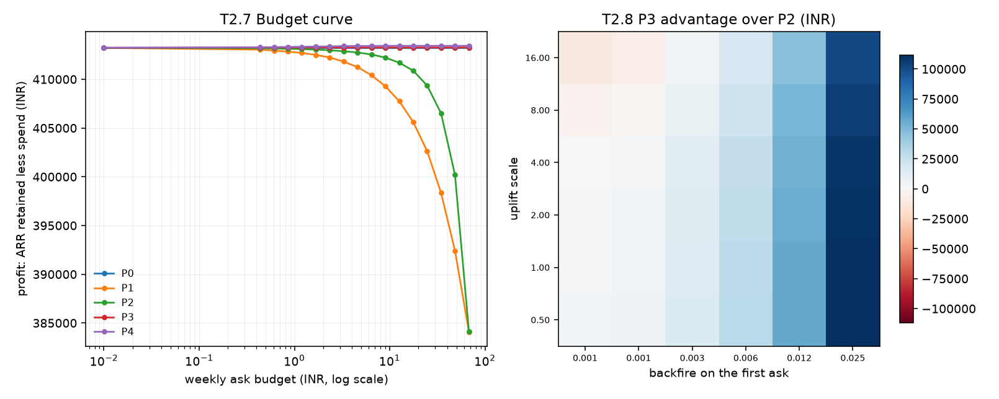

# Results

**Generated by `scripts/make_results.py`. Do not edit by hand.** CI regenerates
this file and fails if a single character differs, which is GATE 2's
byte-identical requirement made enforceable rather than promised.

Every number below comes from `data/sample/` -- the committed
5,079-subscriber slice (`mapping.md` §4) -- so a
fresh clone reproduces all of it with no download:

```
uv run python scripts/make_results.py
```

The full-data equivalents of the model numbers are in [`eval.md`](./eval.md).
The sample is a smoke test for the pipeline, not a second opinion on it.

---

## 1. The book being simulated

| quantity | value |
|---|---:|
| subscribers in the sample | 5,079 |
| mandates in the book | 3,029 |
| person-weeks in the frame | 129,559 |
| spells ending in a death | 1,646 |
| **live mandates at the snapshot** | **1,354** |
| horizon | 12 weeks |
| bulk channel | `email` at INR 0.05 |
| hazard model, Brier on held-out data | 0.007494 |

Only mandates that were alive at the snapshot are simulated. A retention system
cannot be run on a mandate that already died, and including the dead ones would
let every arm claim credit for saving them.

### The projected hazard

Each live mandate's features are rolled forward week by week and scored with the
hazard model's own expression -- the same one `eval.md` §2 validated. The renewal
column is the cheap sanity check: a 30-day mandate should pay about three times
over twelve weeks.

| week | median hazard | median days to coverage end | median renewals paid |
|---:|---:|---:|---:|
| 0 | 0.00164 | 14 | 0 |
| 1 | 0.00175 | 14 | 0 |
| 2 | 0.00160 | 15 | 1 |
| 3 | 0.00145 | 15 | 1 |
| 4 | 0.00155 | 14 | 1 |
| 5 | 0.00149 | 14 | 1 |
| 6 | 0.00146 | 15 | 2 |
| 7 | 0.00147 | 14 | 2 |
| 8 | 0.00146 | 14 | 2 |
| 9 | 0.00142 | 15 | 2 |
| 10 | 0.00142 | 15 | 3 |
| 11 | 0.00140 | 14 | 3 |

---

## 2. The ladder

At a budget of INR 67.70 per week -- enough for one ask per mandate per
week, so the budget does not bind and each arm asks as much as it wants to.

**1,354 live mandates**, 12-week horizon.

| arm | retained | rate | revocations caused | ARR retained (INR) | asks | INR/ask | net value (INR) | theta |
|---|---:|---:|---:|---:|---:|---:|---:|---:|
| P0 | 1,215.3 | 89.758% | 0.0 | 413,219 | 0 | 0.00 | 0 | -- |
| P1 | 1,131.9 | 83.595% | 90.6 | 384,906 | 16,236 | -18.61 | -302,204 | -- |
| P2 | 1,132.0 | 83.604% | 90.4 | 384,953 | 16,236 | -18.61 | -302,089 | -- |
| P3 | 1,215.4 | 89.765% | 0.1 | 413,262 | 49 | 0.30 | 14 | -- |
| P4 | 1,215.9 | 89.801% | 0.3 | 413,470 | 109 | 0.74 | 81 | 0.00 |

| arm | what it does |
|---|---|
| `P0` | contacts nobody. The floor. |
| `P1` | first-come, first-served until the budget runs out -- the campaign-tool default. |
| `P2` | the same budget, rotated fairly. |
| `P3` | top-B by expected rupee value, pricing backfire. |
| **`P4`** | **ours** -- multiple-choice knapsack over (mandate, channel), solved under the shared budget, with the LP dual as theta. |

```
cost of one ask  = backfire(1) x channel softness x loss_on_revocation
gain at hazard h = h x uplift x efficacy[channel] x loss_on_lapse
```

**`P3` buys 49 asks out of a possible 16,236** -- 0.30% of what
the budget would allow -- and creates
INR 14 of net value at INR 0.30
per ask. It is barely worth doing: the gain is
0.010% of the book.
Selection here is not a large win; it is the difference between a small gain
and a large loss.

**`P4` is the first arm that is ours**, and it differs from `P3` in exactly two
ways: it picks a channel per mandate rather than using one for everybody, and it
solves the whole week under the shared budget instead of taking the top-B of a
sort. They price asks identically -- same `value/` module, same coefficients -- so
the gap between them is allocation and nothing else.

It is worth INR 171 more than `P3` here, on
109 asks against 49.

**theta = INR 0.0000** per rupee of weekly ask budget. This is the number the whole
project exists to produce -- *every extra rupee of budget returns theta rupees of
value, net of that rupee* -- and it comes from the LP relaxation's dual on the
budget constraint, not from a heuristic (ADR 0002).

Zero is a real price, not a missing one: at this budget the constraint is
slack, so the next rupee buys nothing. It is also a consequence of the free
channel -- `in_app` costs nothing, so anything worth contacting can be
contacted without touching the budget at all. **No mandate here is refused for
lack of money**; every refusal is "not worth asking". The budget rations
*which channel*, not *whether* -- which is `problem.md` §5.1 falling out of the
solver rather than being asserted at it.

The large number in this table is on the other side. `P1` and `P2`, spending a
budget that never binds, destroy
INR 29,124 and
INR 29,078 of profit respectively, while
their entire channel spend is INR 811.80. That is
`problem.md` §5.1 measured instead of asserted: **the spend is not the
constraint, the customer's patience is.**

`P1` and `P2` come out within a rupee of each other here because the budget does
not bind -- both contact everyone every week, so there is nothing for a rotation
to rotate. They separate as soon as the budget does bind, which is §3.

---

## 3. The budget curve (T2.7)

Profit is ARR retained less what was spent retaining it.

| arm | optimum budget | asks there | profit at optimum | gain over doing nothing | under-ask cost | over-ask cost |
|---|---:|---:|---:|---:|---:|---:|
| P0 | INR 0.00 | 0 | INR 413,219 | INR 0 | -- | -- |
| P1 | INR 0.00 | 0 | INR 413,219 | INR 0 | -- | -- |
| P2 | INR 0.00 | 0 | INR 413,219 | INR 0 | -- | -- |
| P3 | INR 0.61 | 49 | INR 413,260 | INR 41 | 5.6% | 0.8% |
| P4 | INR 12.59 | 109 | INR 413,432 | INR 188 | 4.5% | 0.9% |

| budget | P0 | P1 | P2 | P3 | P4 |
|---:|---:|---:|---:|---:|---:|
| 0.00 | 413,219 | 413,219 | 413,219 | 413,219 | 413,244 |
| 0.44 | 413,219 | 413,044 | 413,177 | 413,258 | 413,283 |
| 0.61 | 413,219 | 412,942 | 413,156 | 413,260 | 413,294 |
| 0.85 | 413,219 | 412,835 | 413,127 | 413,260 | 413,315 |
| 1.19 | 413,219 | 412,707 | 413,096 | 413,260 | 413,329 |
| 1.67 | 413,219 | 412,502 | 413,045 | 413,260 | 413,351 |
| 2.34 | 413,219 | 412,239 | 412,975 | 413,260 | 413,375 |
| 3.28 | 413,219 | 411,812 | 412,880 | 413,260 | 413,402 |
| 4.59 | 413,219 | 411,249 | 412,745 | 413,260 | 413,412 |
| 6.42 | 413,219 | 410,413 | 412,545 | 413,260 | 413,424 |
| 8.99 | 413,219 | 409,283 | 412,220 | 413,260 | 413,428 |
| 12.59 | 413,219 | 407,743 | 411,698 | 413,260 | 413,432 |
| 17.62 | 413,219 | 405,606 | 410,881 | 413,260 | 413,430 |
| 24.67 | 413,219 | 402,628 | 409,355 | 413,260 | 413,430 |
| 34.54 | 413,219 | 398,341 | 406,512 | 413,260 | 413,430 |
| 48.36 | 413,219 | 392,407 | 400,182 | 413,260 | 413,430 |
| 67.70 | 413,219 | 384,094 | 384,141 | 413,260 | 413,430 |

**`P4` has an interior optimum at INR 12.59 per
week** -- 109 asks over the horizon, worth
INR 188 more than doing nothing. Every other arm's
optimum is still zero: they have no way to decline an ask, so more budget can
only hurt them.

The curve is **asymmetric in the direction Zhang predicted**. Halving the optimum
budget costs 4.5% of the gain; doubling it costs 0.9%. Under-asking
is the more expensive mistake here by a factor of about
5x -- Zhang's calibration puts it at roughly 2x, so the shape
agrees and the magnitude does not, which is what a different book and a different
set of swept parameters should be expected to produce.

---

## 4. Where the answer changes (T2.8)

Uplift and backfire have no public measurement -- `calibration.md` §4 records both
as swept. Section 2's result turns on them by a margin of about 3%, so the honest
output is a region rather than a point estimate.

Challenger `P3` against reference `P2`, at a budget of INR 67.70/week -- enough for one ask per mandate per week, so the reference contacts everyone.

Cells give the challenger's advantage in rupees. **(parentheses)** mark cells where the challenger asked *nobody*: the advantage there is the reference's loss, not our gain.

| uplift \ backfire | 0.0005 | 0.0010 | 0.0030 | 0.0060 | 0.0120 | 0.0250 |
|---|---:|---:|---:|---:|---:|---:|
| **0.50** | +2,742 | +5,251 | +15,180 | +29,726 | (+57,455) | (+111,600) |
| **1.00** | +2,234 | +4,721 | +14,605 | +29,118 | +56,861 | (+111,091) |
| **2.00** | +1,218 | +3,718 | +13,547 | +28,042 | +55,740 | +110,084 |
| **4.00** | -750 | +1,867 | +11,766 | +26,171 | +53,826 | +108,202 |
| **8.00** | -4,427 | -1,797 | +8,579 | +23,097 | +50,741 | +105,144 |
| **16.00** | -10,337 | -7,828 | +3,111 | +18,668 | +46,324 | +100,925 |

The challenger judged at least one ask worth making in **92%** of the plane.



Two things to read off the plane.

**There is a clean frontier.** Asking pays when uplift is large relative to
backfire, and the boundary runs diagonally. The shipped point sits just on the
wrong side of it: at `uplift_scale = 1.0` and a first-ask backfire of 0.006, no ask
is worth making, and one step in either direction flips that.

**Most of the plane's headline numbers are not our win.** In the parenthesised
cells `P3` asked nobody, so its advantage over `P2` is entirely `P2`'s loss. Those
cells say the reference is burning money, not that selection works. The unbracketed
cells are the ones that support a claim about this approach, and there are fewer of
them.

---

## 5. What this does and does not show

* **The arms are not yet ours.** `P4` (multiple-choice knapsack) and `P5` (Whittle
  index) are Phase 3. `P3` is the strongest arm here and it is a sort.
* **`theta` is null everywhere.** The shadow price comes from the LP dual in `P4`.
* **Expectations, not samples.** Every mandate carries a survival probability rather
  than a sampled outcome, so these are mean results with no variance attached. The
  harness cannot answer "how often does this policy do worse than doing nothing".
* **The uplift mechanism is a modelling choice.** An ask multiplies the hazard by
  `(1 - uplift_scale x efficacy)`, so it saves a share of the deaths that would have
  happened. Reading `efficacy_prior` as an outright conversion rate instead would let
  an ask save a mandate that was never going to die, and that is how a simulator ends
  up claiming a 40% lift against Adyen's ~6%.
* **KKBox is not an Indian mandate book.** Everything inherits `mapping.md` §3.9.
